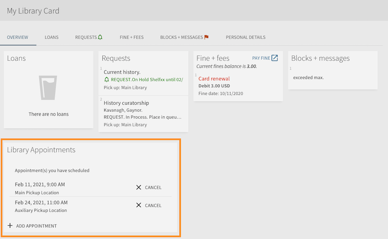
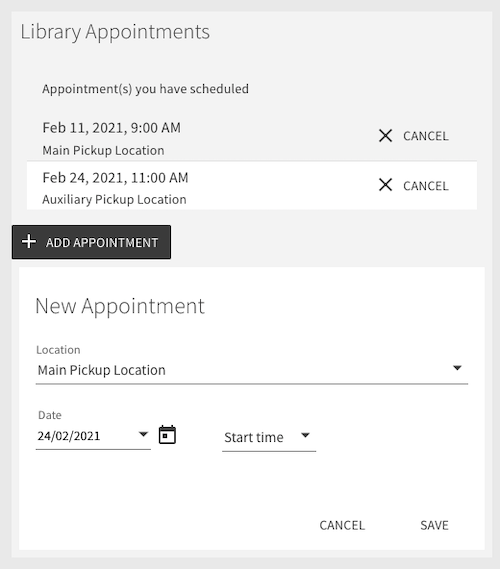

# primo-explore-appointment-scheduler
Adds a widget in Primo VE account overview screen to allow patrons to manage their appointments made with the [Alma Appointment Scheduler Cloud App](https://developers.exlibrisgroup.com/appcenter/appointment-scheduler/). This add-on is also available in [Primo Studio](http://primo-studio.exlibrisgroup.com).

## Features
* View/cancel existing appointments
* Create new appointment
* Cancel existing appointment
* Works with configuration from the Appointment Scheduler Cloud App
  * List of locations
  * Lists appointment slots based on start and end hours
  * Lists appointment slots dependent on location capacity
* Supports overriding display strings and localizations based on Primo interface language

### Screenshots

_Account home page_


_Widget in new appointment state_

## Install
1. Make sure you've installed and configured [primo-explore-devenv](https://github.com/ExLibrisGroup/primo-explore-devenv).
2. [Download your customization package](https://knowledge.exlibrisgroup.com/Primo/Product_Documentation/020Primo_VE/Primo_VE_\(English\)/050Display_Configuration/010Configuring_Discovery_Views_for_Primo_VE#Branding_Your_View) and navigate to your template/central package root directory. For example:
    ```
    cd primo-explore/custom/MY_INST_CODE-MY_VIEW_ID
    ```
3. If you do not already have a `package.json` file in this directory, create one:
    ```
    npm init -y
    ```
4. Install this package:
    ```
    npm install primo-explore-appointment-scheduler --save-dev
    ```

## Usage
It's best to use the `--browserify` build option when using this library. That means placing your customization JavaScript in a separate file such as `main.js`. When building with the `--browserify` option, your code and any dependencies (such as this package) are "minified" and copied into the `custom.js` file which is used by Primo. 

In the `main.js` file, import the module and then add `appointmentScheduler` as a dependency for your custom module definition.
```javascript
import 'primo-explore-appointment-scheduler';

const app = angular.module('viewCustom', ['appointmentScheduler']);
```

Add the `appointment-scheduler` component to the `prmAccountOverviewAfter` placeholder as follows:
```js
/** Appointment Scheduler in Library Card */
app.component('prmAccountOverviewAfter', {
  bindings: {parentCtrl: '<'},
  template: `<appointment-scheduler 
    parent-ctrl="$ctrl.parentCtrl"
    apikey="l8xx..."
  ></appointment-scheduler>`
});
/** END Appointment Scheduler in Library Card */
```

Restart your development environment and test the add-on by logging in and navigating to the library card. You should see the Appointment Scheduler add-on.
```
gulp run --view MY_INST_CODE-MY_VIEW_ID --ve --browserify
```

Now you're ready to create your customization package and upload it to your Primo VE view using the View Management screen.
```
gulp create-package --browserify
```

*Note about sandboxes*: Note that the Scheduler Primo Add-on uses the location configuration from the Alma Scheduler Cloud App. The add-on only supports one set of configuration at a time, so if you don't see the locations you expect in the add-on, simply save the configuration in the Cloud App in the desired Alma environment and the locations in the add-on will update accordingly.

## Configuration
The following configuration parameters are available:
| Parameter | Description |
| --- | --- |
| apikey | An [API key](https://developers.exlibrisgroup.com/primo/apis/) which is configured for read-only on the **Primo Public Key API only**. (This is important as the key will be exposed in the HTML). The key is used to validate the authorization token.   |
| i18n |  Overrides for the strings used in the display. The list of string is available [here](https://github.com/ExLibrisGroup/alma-scheduler/blob/master/primo-explore-appointment-scheduler/src/i18n.js). Any string not provided will fall-back to the default. Strings can be provided in different Primo locales (i.e. en, fr). <br>Example:<br><pre>i18n='{<br>  en: {<br>    appointments: "Library Appointments"<br>  },<br>  fr: {<br>    appointments: "Rendez-vous à la bibliothèque"<br>  }<br>}'</pre>|

## Development
To build this add-on, use:
```
npm run build
```

To publish:
```
npm publish
```

## Contributions
We welcome contributions to this community-supported add-on. We're also happy to add additional default translations to the [string file](https://github.com/ExLibrisGroup/alma-scheduler/blob/master/primo-explore-appointment-scheduler/src/i18n.js).
